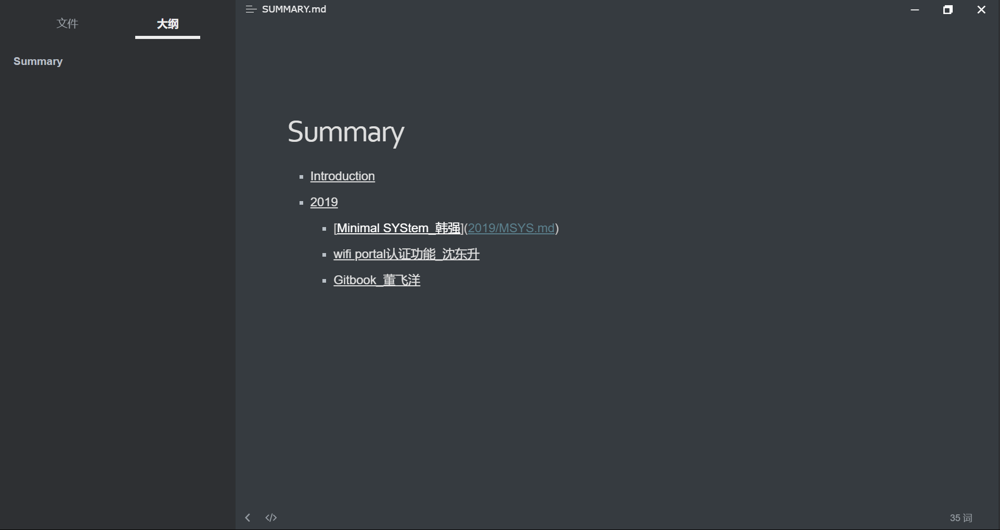
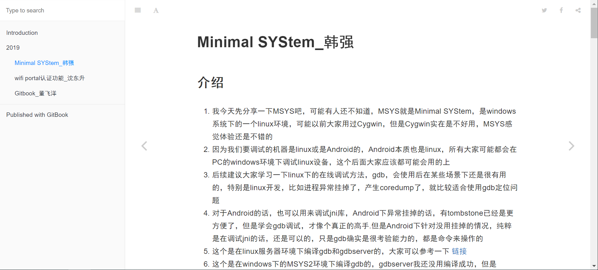

# Gitbook_董飞洋

## 介绍

我们经常有写博客或记笔记的需求,通常我们会用CSDN,简书等博客网站,或者用印象笔记,OneNote等笔记软件.但是这些网站和软件或多或少都存在广告多,不支持markdown语法,不能自由导出等问题.而gitbook 结合了git 和 markdown ,可以方便的进行版本控制和多人协作,快速生成一本书(不仅仅是一篇文章了,是一本书啊~~)

## 安装

1. 因为 GitBook 是基于 Node.js，所以我们首先需要安装 Node.js.[下载地址](https://nodejs.org/zh-cn/)，找到对应平台的版本安装即可，之后在命令行运行 npm install -g gitbook-cli  ,安装gitbook脚手架,安装需要一段时间,安装完成后,输入 gitbook  --version ,会自动下载gitbook,出现版本信息就代表成功了.

2. 在电脑上创建一个文件夹,在目录下运行 gitbook init ,它会自动生成 README.md 和 SUMMARY.md ,其中README里是书籍的介绍,SUMMARY是这本书的目录.然后执行 git init 加入版本控制

3. 在SUMMARY里我们编辑内容类似这样:然后再次执行 gitbook init .它就会自动帮我们创建好目录和文件

   

4. 在对应md文件中编辑好内容以后,执行 gitbook serve --port 4000,会生成网页,打开浏览器 ,输入 localhost:4000 就可以看到书籍的内容了.

   

